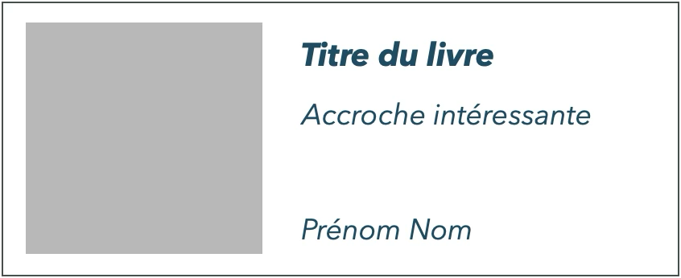

# Livre dont vous êtes le héros

## Introduction

Ce projet est un livre dont vous êtes le héros ou l'héroïne. Il s'agit d'un livre interactif où le lecteur ou la lectrice est amené·e à faire des choix qui influent sur le déroulement de l'histoire. Le but est de parvenir à la fin de l'histoire en faisant les bons choix.

## Consignes 1

- Clôner le repository sur votre machine
- Créer des pages HTML dans le dossier `projet` pour chaque section du livre
- Créer des liens entre les pages pour permettre à l'utilisateur de faire des choix
- Créer au moins 4 pages pour le livre
- Mettre en forme les pages avec du CSS (fichier unique)
- Ajouter des images pour illustrer le texte (optionnel)

**Vous pouvez supprimer le fichier `.gitkeep` du dossier `projet`.**

Exemple de structure pour le projet:

```bash
├── projet
│   ├── images
│   │   ├── image-2.jpg
│   │   └── image.jpg
│   ├── index.html
│   ├── page1.html
│   ├── page2.html
│   ├── page3.html
│   ├── page4.html
│   └── styles.css
├── index.html
├── README.md
└── styles.css
```

## Consignes 2

Dans un deuxième temps, nous allons créer le teaser du livre. Pour cela, vous allez créer une page `index.html` à la racine du projet.

- Cette page contiendra un teaser cliquable qui redirige vers la première page du livre
- Le teaser doit contenir :

  - une image illustrant le livre
  - le titre du livre
  - un texte accrocheur qui donne envie de lire le livre
  - vos prénom et nom

- Le teaser doit être mis en forme avec des Flexbox
- Le teaser doit avoir un style cohérent avec votre livre (couleurs, typographie, etc.)
- L'image doit être positionnée à gauche du texte
- Largeur maximale du teaser : 600 pixels
- Couleur de fond de la page: `#1a1a1a`



### Critères d'autoévaluation

| Critères d'autoévaluation                      |     | Points |
| ---------------------------------------------- | --- | ------ |
| **Respect des consignes**                      |     | 3      |
| - Structure du projet respectée                | 1   |        |
| - Projet de livre présent dans le dossier      | 1   |        |
| - Teaser présentant tous les éléments demandés | 1   |        |
| **Qualité du code HTML et CSS**                |     | 12     |
| - Code HTML valide et sans erreurs             | 3   |        |
| - Code CSS valide et sans erreurs              | 3   |        |
| - Utilisation adaptée de Flexbox               | 3   |        |
| - Application des bonnes pratiques CSS & HTML  | 3   |        |
| **Qualité de réalisation du teaser**           |     | 4      |
| - Image cohérente avec le contenu du livre     | 1   |        |
| - Mise en forme du teaser créative             | 1   |        |
| - Originalité du texte accrocheur              | 1   |        |
| - Lien fonctionnel vers la première page       | 1   |        |
| **Total**                                      |     | **19** |

3: Parfait, 2: Bien, 1: Peut mieux faire, 0: Insatisfaisant
